# Udaya Pragna Gangavaram

B.Tech CSE (AI & ML) | AI Research Intern | Software Engineering Enthusiast

[GitHub](https://github.com/Udaya-P) · [LinkedIn](https://linkedin.com/in/udaya-pragna-gangavaram) · [Portfolio](https://my-portfolio-phi-blush-71.vercel.app/) · [Email](mailto:udayapragnag@gmail.com)

## Hero

Building intelligent systems with a software engineering mindset, with current emphasis on explainable NLP, research-to-product thinking, and strong backend fundamentals.

## About

<table>
  <tr>
    <td width="34%" valign="top">
      
    </td>
    <td width="66%" valign="top">
      
I'm a Computer Science (AI & ML) student at PES University with a passion for building intelligent software that solves real-world problems. My interests lie at the intersection of Software Engineering, Machine Learning, and Explainable AI, where I enjoy transforming research ideas into practical applications. Currently, I'm working on financial misinformation detection and explainable NLP systems while continuously strengthening my foundations in data structures, system design, and backend development.

      <ul>
        <li>Computer Science (AI &amp; ML) student at PES University, Bengaluru</li><li>Based in Bengaluru, Karnataka, India</li><li>Graduating in 2027</li><li>Interested in Software Engineering, Machine Learning, and Explainable AI</li>
      </ul>
      
<strong>Current focus:</strong> Financial misinformation detection, Explainable NLP systems, Backend fundamentals and system design

      
<strong>Currently learning:</strong> Advanced Data Structures & Algorithms, Dynamic Programming, Backend Development with Spring Boot, System Design, Agentic AI, Large Language Models

      
    </td>
  </tr>
</table>

## Featured Projects

### Financial Misinformation Detection & Explainable NLP
Explainable NLP system for detecting rumors and misinformation in financial claims using transformer models and a custom linguistic explanation pipeline.

- Status: `Current`
- Stack: `Python · RoBERTa · FinBERT · Transformers · PyTorch · spaCy · SHAP · Flask`
- Collaboration: Independent project
- Repository: [Udaya-P/FLAME_APP](https://github.com/Udaya-P/FLAME_APP)
- Link status: Verified as a public repository on July 23, 2026.

### Citrus Disease Prediction with Severity Analysis
AI-powered disease diagnosis system that detects citrus leaf diseases, estimates severity, and recommends treatments using deep learning.

- Status: `Ongoing`
- Stack: `Python · PyTorch · Flask · React · OpenCV · TensorFlow`
- Collaboration: Independent project
- Repository: https://github.com/Udaya-P/citrus-leaf-disease-detection
- Link status: Public link could not be verified on July 23, 2026, so it is shown as provided.

### LearnMate
Agentic AI career guidance assistant built using IBM watsonx to generate personalized learning and career recommendations.

- Status: `Completed`
- Stack: `IBM watsonx · Python · IBM Cloud · Granite Models`
- Collaboration: Independent project
- Repository: [Udaya-P/LearnMate](https://github.com/Udaya-P/LearnMate)
- Link status: Verified as a public repository on July 23, 2026.

### Employee Attrition Prediction System
HR analytics platform that predicts employee attrition and analyzes workforce factors using machine learning.

- Status: `Completed`
- Stack: `Python · Flask · MySQL · Scikit-learn · GitHub Actions`
- Collaboration: Collaborative project in the pestechnology organization. Public contributor metadata could not be verified at generation time, so collaborator names are intentionally omitted rather than guessed.
- Repository: https://github.com/pestechnology/PESU_EC_AIML_B_P16_Attrition_analysis_system_Sai-Hemanth
- Link status: Public link could not be verified on July 23, 2026, so it is shown as provided.

### PoolU - Ride Sharing System
Layered Spring Boot ride-sharing system for creating and joining ride pools, managing ride status, splitting fares, and collecting post-ride reviews that update a user karma score.

- Status: `Completed`
- Stack: `Java · Spring Boot · Spring Data JPA · H2 Database · Maven · REST APIs`
- Collaboration: Collaborative project with Pidapa Indira, Sai Hemanth M, and Sai Jaswanth Akula. Udaya implemented the PoolFactory and applied the Single Responsibility Principle (SRP).
- Repository: [Udaya-P/Ridesharing_system_OOAD](https://github.com/Udaya-P/Ridesharing_system_OOAD)
- Link status: Verified as a public repository on September 4, 2026.

### Skill-Role Graph Explorer
Graph-based career recommendation system that uses Node2Vec embeddings on a heterogeneous role-skill graph to recommend skills, roles, and realistic career transitions, including missing-skill analysis.

- Status: `Completed`
- Stack: `Python · Flask · NetworkX · Node2Vec · Word2Vec · Scikit-learn · D3.js`
- Collaboration: Independent project
- Repository: [Udaya-P/Skill-Role-Graph-Explore](https://github.com/Udaya-P/Skill-Role-Graph-Explore)
- Link status: Verified as a public repository on September 4, 2026.

### Distributed Real-Time Drawing Board
Fault-tolerant collaborative drawing board built on a three-replica, Mini-RAFT-inspired backend with leader election, majority-committed stroke replication, automatic failover, restarted-node catch-up, and replayable drawing history.

- Status: `Completed`
- Stack: `Python · FastAPI · WebSockets · HTTPX · HTML · CSS · JavaScript · Docker · Docker Compose`
- Collaboration: Collaboration details not provided.
- Repository: [Udaya-P/Distributed-drawing-board](https://github.com/Udaya-P/Distributed-drawing-board)
- Link status: Verified as a public repository on September 4, 2026.

## Tech Stack

- **Languages:** Python, Java, C, SQL
- **Machine Learning & AI:** PyTorch, TensorFlow, Scikit-learn, Transformers, spaCy, OpenCV, NumPy, Pandas
- **Backend:** Spring Boot, Flask, REST APIs, MySQL, H2 Database
- **DevOps & Tools:** Git, GitHub, GitHub Actions, Maven, Jira, Linux
- **Core Computer Science:** Data Structures & Algorithms, Object-Oriented Programming, Operating Systems, DBMS, System Design, Design Patterns

## GitHub Analytics

## Timeline

- **2023** — Started B.Tech in Computer Science (AI & ML) at PES University
- **2024** — Participated in Hacknight and Space Race Hackathons
- **2025** — AI & Cloud Technologies Intern at IBM SkillsBuild (Edunet Foundation)
- **2026** — AI Research Intern at CCBD & CDSAML Research Center; started explainable financial misinformation research
- **2027** — Goal: Software Engineer / AI Engineer

## Contact

I'm always happy to connect around AI engineering, explainable ML, backend systems, and thoughtful software development.

- Email: [udayapragnag@gmail.com](mailto:udayapragnag@gmail.com)
- LinkedIn: [linkedin.com/in/udaya-pragna-gangavaram](https://linkedin.com/in/udaya-pragna-gangavaram)
- Portfolio: [https://my-portfolio-phi-blush-71.vercel.app/](https://my-portfolio-phi-blush-71.vercel.app/)
- GitHub: [Udaya-P](https://github.com/Udaya-P)

## Footer

